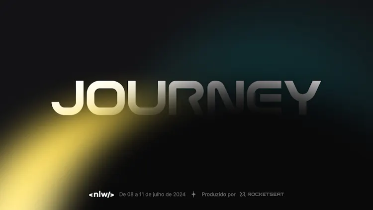

  

 

Aplicação desenvolvida durante o evento `nlw journey` da Rocketseat (trilha NodeJs).

Esta é a API da aplicação de nome Plann.er, a qual consiste em um sistema de planejamento de viagens.

Tecnologias utilizadas:

   
